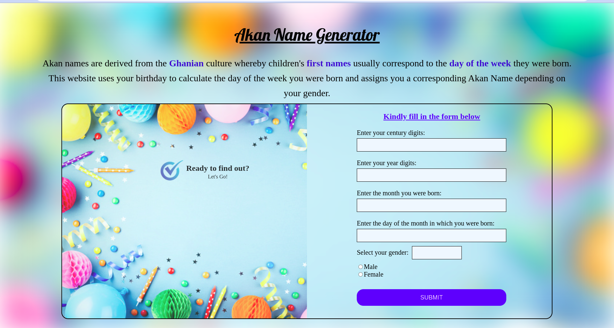

# Akan-Name-Generator

## Project Description
It's a web application that takes in a user's birthday and calculates the day of the week they were born and then depending on their gender, it outputs their Akan Name. Akan names are derived from the Ghanian culture whereby children are given their first name as a 'day name' which corresponds to the day in the week they were born. The Ghanian day names are shown below:-

### Male Names
- Sunday: Kwasi
- Monday: Kwadwo
- Tuesday: Kwabena
- Wednesday: Kwaku
- Thursday:  Yaw
- Friday: Kofi
- Saturday: Kwame

### Female Names
- Sunday: Akosua
- Monday: Adwoa
- Tuesday: Abenaa
- Wednesday: Akua
- Thursday:  Yaa
- Friday: Afua
- Saturday: Ama

The website displays male Akan Names for males born between January and June and female Akan Names for females born between July and December.

## Figma Design Link
- [Check it out here](https://www.figma.com/file/xUCLYXtYLbvf91j2kdOTJ4/Akan-Name-Generator?node-id=0%3A1)

## Website Link
- [Check it out here](https://shalyne-waweru.github.io/My-Portfolio/)

## Author
- [Shalyne Waweru](https://github.com/Shalyne-Waweru/My-Portfolio.git)
- Email: shalynewaweru@gmail.com

## Project setup instructions
To start using this project use the following commands:

- `git clone https://github.com/Shalyne-Waweru/Akan-Name-Generator.git`
- `cd Akan-Name-Generator`
-  Open `index.html` on your Browser

## Technologies Used
- HTML
- CSS
- Google Fonts
- Javascript

## Behaviour Driven Development
+ BEHAVIOUR: Display a form for entering the century, year, month, date and gender
    * INPUT: "User's birthday Century, Year, Month and Date"
    * INPUT: "User's selected gender"
    * OUTPUT: "Display a User's Akan Name According to Submitted Month and Gender"
    
 + BEHAVIOUR: Display an alert error message if the century entered is invalid
    * INPUT: "21"
    * OUTPUT: "Enter a valid century between 18 and 20!"

 + BEHAVIOUR: Display an alert error message if the month entry is invalid
    * INPUT: "14"
    * OUTPUT: "Enter a valid month!"

 + BEHAVIOUR: Display an alert error message if the date entry is invalid
    * INPUT: "0"
    * OUTPUT: "Enter a valid date!"

## License info
MIT License

Copyright (c) 2022 Shalyne Waweru

Permission is hereby granted, free of charge, to any person obtaining a copy
of this software and associated documentation files (the "Software"), to deal
in the Software without restriction, including without limitation the rights
to use, copy, modify, merge, publish, distribute, sublicense, and/or sell
copies of the Software, and to permit persons to whom the Software is
furnished to do so, subject to the following conditions:

The above copyright notice and this permission notice shall be included in all
copies or substantial portions of the Software.

THE SOFTWARE IS PROVIDED "AS IS", WITHOUT WARRANTY OF ANY KIND, EXPRESS OR
IMPLIED, INCLUDING BUT NOT LIMITED TO THE WARRANTIES OF MERCHANTABILITY,
FITNESS FOR A PARTICULAR PURPOSE AND NONINFRINGEMENT. IN NO EVENT SHALL THE
AUTHORS OR COPYRIGHT HOLDERS BE LIABLE FOR ANY CLAIM, DAMAGES OR OTHER
LIABILITY, WHETHER IN AN ACTION OF CONTRACT, TORT OR OTHERWISE, ARISING FROM,
OUT OF OR IN CONNECTION WITH THE SOFTWARE OR THE USE OR OTHER DEALINGS IN THE
SOFTWARE.
